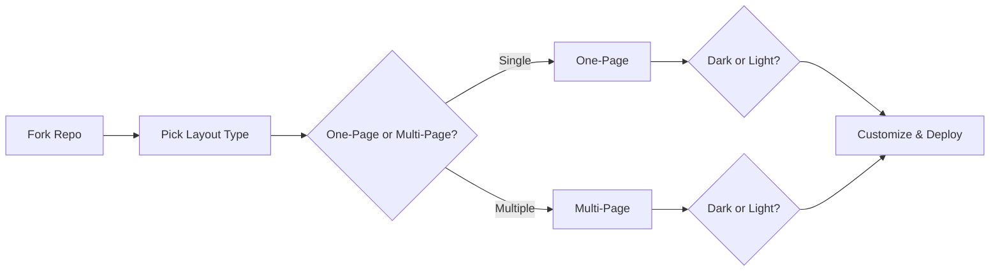

<div align="center">

# 📱 HTML5 Responsive Template

*Complete HTML5 responsive templates – multiple layouts with dark & light themes included*

[](https://vercel.com/new/clone?repository-url=https://github.com/MrShadowRIFAT/9BT839E-HTML5_Responsive_Template)


**Mobile-first. Modern. Production-ready.**

</div>

---

## ✨ Why This Project

A comprehensive collection of responsive HTML5 templates. Choose between single-page or multi-page layouts, light or dark themes. Perfect for any web project—no frameworks needed, just pure HTML/CSS/JS.

---

## 🔥 Features

📱 **Fully Responsive** – Mobile, tablet, desktop perfected  
🎨 **4 Layout Options** – One-page & multi-page in light & dark  
⚡ **Fast Loading** – Optimized performance  
🌙 **Dark & Light Themes** – Both included  
💻 **Vanilla HTML/CSS/JS** – No dependencies  
🚀 **Production Ready** – Deploy immediately  
✏️ **Easy Customization** – Clean, well-organized code  

---

## 🚀 Quick Setup

### 1️⃣ Fork Repository
```bash
# Click Fork button on GitHub
# Your own copy is ready
```

### 2️⃣ Deploy with Vercel
Press the button above → Connect GitHub → Deploy (instant!)

### 3️⃣ Local Development
```bash
git clone https://github.com/YOUR_USERNAME/9BT839E-HTML5_Responsive_Template.git
cd 9BT839E-HTML5_Responsive_Template
python -m http.server 8000
# Open http://localhost:8000
```

---

## 📁 Project Structure

| Folder | Purpose |
|--------|---------|
| `onepage/` | Single-page template layouts |
| `onepage/light/` | Light theme one-page |
| `onepage/dark/` | Dark theme one-page |
| `multipage/` | Multi-page template layouts |
| `multipage/light/` | Light theme multi-page |
| `multipage/dark/` | Dark theme multi-page |

---

## 🧠 How It Works



---

## 🎯 Template Options

| Type | Light | Dark | Best For |
|------|-------|------|----------|
| **One-Page** | ✅ | ✅ | Landing pages, portfolios |
| **Multi-Page** | ✅ | ✅ | Websites, blogs, services |

---

## 🛠️ Tech Stack

<div align="center">


</div>

**HTML5** • **CSS3** • **JavaScript** • **Responsive Design** • **Mobile-First**

---

## 📝 Customization

1. **Choose Template** – Pick `onepage/` or `multipage/`
2. **Select Theme** – Use `light/` or `dark/`
3. **Edit Content** – Update `.html` files
4. **Replace Images** – Add your media
5. **Customize Colors** – Modify CSS for branding
6. **Update Typography** – Change fonts & sizes

---

## 🎨 Design Features

✨ **Modern Aesthetics** – Contemporary design patterns  
📐 **Grid System** – Well-structured layouts  
🔌 **Plugin Ready** – Easy to extend  
🎯 **Call-to-Actions** – Conversion optimized  
📸 **Image Galleries** – Portfolio sections included  
📞 **Contact Forms** – Lead capture ready  
⚙️ **Footer Content** – Full customizable footers  

---

## 📦 Deployment

| Platform | Deploy Time | Cost |
|----------|-------------|------|
| **Vercel** | < 1 min | Free |
| **GitHub Pages** | 2 mins | Free |
| **Netlify** | 2 mins | Free |
| **Shared Hosting** | 5 mins | Paid |

---

## 💡 Use Cases

🏢 **Business Sites** – Corporate websites  
🎨 **Portfolios** – Designer/developer showcase  
📝 **Blogs** – Content publishing sites  
🛍️ **Shops** – E-commerce ready  
📱 **Landing Pages** – Product launches  
🏫 **Education** – Course websites  
🏥 **Services** – Professional services  

---

## 📊 GitHub Stats

<div align="center">


</div>

---

## 👨‍💼 Author

**MrShadowRIFAT** | [🔗 rifat.website](https://rifat.website) | [📧 noreply@rifat.website](mailto:noreply@rifat.website)

---

<div align="center">

**[⭐ Star This Repo](#)** • **[🐛 Report Issue](#)** • **[💡 Suggest Feature](#)**

Made with ❤️ for responsive web design

</div>